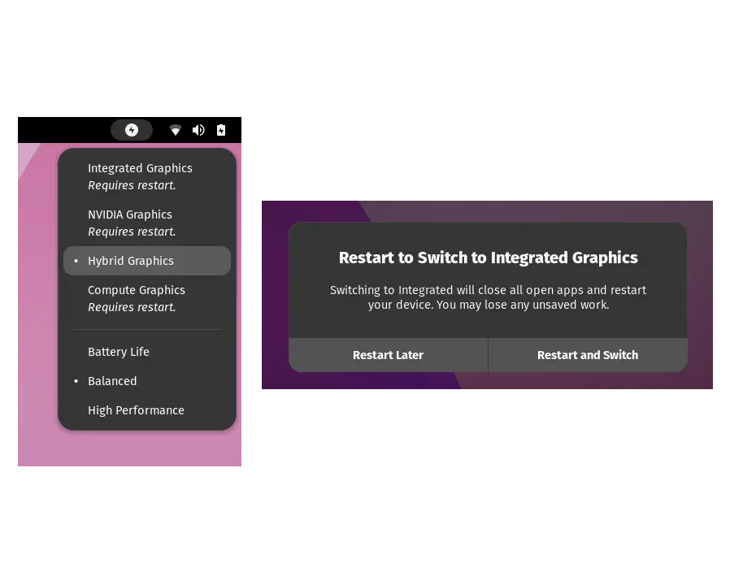

# System76 Power Management

**[gnome-shell-extension-system76-power](https://github.com/pop-os/gnome-shell-extension-system76-power)** is a GNOME Shell extension that adds graphical integration with the [system76-power](https://github.com/pop-os/system76-power) daemon, including:

- Power profiles (and graphics-switching profiles on applicable systems) in a menu in the top panel
- Prompting to switch graphics modes when necessary to use a hot-plugged display

_This is a fork that supports Gnome v43+ and uses its own panel icon instead of integrating it to the battery menu_

